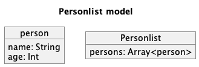
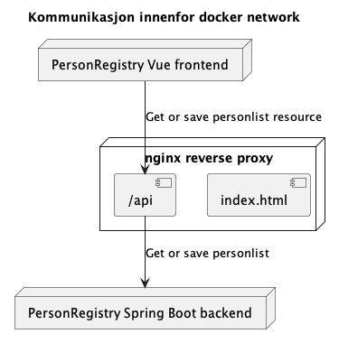

# PersonRegistry

An application that lists persons and allows CRUD operations through the vue frontend.

Consists of a Spring Boot kotlin microservice and typescript vue frontend

## Data model

## Running locally

There are two ways of running frontend and backend together, namely:

1. Running manually with `yarn run dev` and `./gradlew bootRun`(or run configurations in intellij)
2. Using docker-compose to build and run frontend and backend. It is closer to a production environment because it uses nginx for serving the static contents of the site and proxies api calls to the backend.
    - We need to create a common network for frontend and backend. Run `docker network create mono-persons`
    - In dir frontend run `yarn run build` followed by `docker-compose up --build`.,
    - In dir backend run `./gradlew build` followed by `docker-compose up --build`
    - Frontend is now served by nginx and api calls are routed to backend through nginx as well.

### Diagram when running locally

